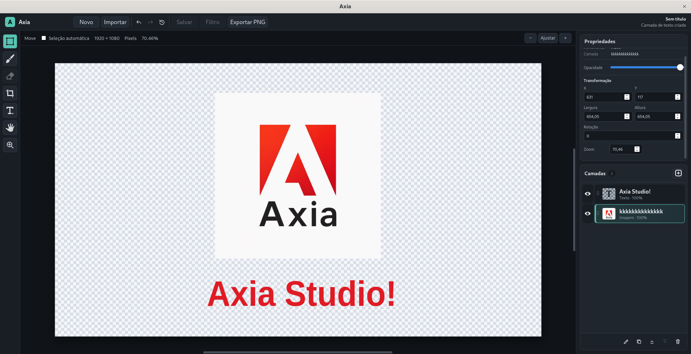

# Axia



Axia é um protótipo de editor de imagem desktop para Linux, construído com Go, Wails, Vue 3, TypeScript e Vite.

## Configuração no Fedora

O instalador configura as bibliotecas nativas do Fedora, Go 1.23.12, Wails 2.12 e Node.js 24 localmente para o projeto:

```sh
./scripts/setup-fedora.sh
```

O `sudo` é usado somente pelo `dnf`. Go, Wails e Node ficam em `.toolchains`, sem alterar instalações globais.

Para disponibilizar `go`, `wails`, `node` e `npm` no terminal atual:

```sh
source ./scripts/env.sh
```

## Desenvolvimento

Em outras distribuições, instale GTK 3, WebKit2GTK 4.1, um compilador C/C++ e pkg-config. Depois execute:

```sh
./scripts/setup-go.sh
./scripts/setup-node.sh
./scripts/frontend-install.sh
```

Rode o app em modo desktop com hot reload:

```sh
./scripts/wails-dev.sh
```

Gerar build:

```sh
./scripts/wails-build.sh
```

No Linux, os scripts usam `-tags webkit2_41`, que é o caminho recomendado para distros recentes onde `webkit2gtk-4.0` não está mais disponível.

## Estrutura

- `app.go`: API Go exposta ao frontend pelo Wails.
- `main.go`: configuração da janela desktop e bootstrap Wails.
- `frontend/src`: interface Vue/TypeScript do editor.
- `frontend/wailsjs`: bindings TypeScript gerados pelo Wails.

## Recursos atuais

- Criação de documentos em pixels ou centímetros.
- Importação de PNG, JPEG e GIF por seletor ou arrastar e soltar.
- Seleção, movimentação, visibilidade e opacidade de camadas.
- Transformação livre de camadas com escala proporcional, escala central e rotação.
- Zoom ancorado no cursor, ajuste à tela e navegação com a ferramenta Mão, tecla Espaço ou botão do meio.
- Exportação da composição em PNG.
- Seleção retangular, elíptica, por laço livre e varinha mágica com tolerância configurável.
- Exclusão destrutiva dos pixels selecionados com suporte completo a desfazer e refazer.
- Pincel redondo de cor sólida para pintura livre sobre camadas de imagem.

As ferramentas ainda não implementadas aparecem desabilitadas para manter a interface coerente com os recursos disponíveis.

## Atalhos de navegação

- `V`, `H` e `Z`: Mover, Mão e Zoom.
- `Espaço` + arrastar ou botão do meio + arrastar: navegar pela imagem.
- `Ctrl` + `Espaço` + clique: zoom temporário; `Alt` + `Espaço` + clique: reduzir temporariamente.
- `Ctrl` + roda do mouse ou `Alt` + roda: zoom suave sob o cursor.
- `Z` + clique: aumentar; `Alt` + clique: reduzir.
- `Ctrl` + `+` / `-`: próximo nível de zoom.
- `Ctrl` + `0`: ajustar à tela; `Ctrl` + `1`: 100%; `Ctrl` + `2`: 200%.
- Duplo clique na Mão ajusta à tela; duplo clique no Zoom retorna a 100%.
- Roda do mouse: navegar verticalmente; `Shift` + roda: navegar horizontalmente.

No macOS, use `Command` no lugar de `Ctrl`.

## Transformação livre

- `Ctrl` + `T`: transformar a camada ativa.
- Arraste dentro da caixa: mover a camada.
- Arraste um canto: redimensionar mantendo a proporção; `Shift` alterna para escala livre.
- `Alt` + arrastar uma alça: redimensionar a partir do centro.
- Arraste o controle circular: girar livremente; `Shift` encaixa a rotação em passos de 15 graus.
- `Enter` ou duplo clique: aplicar; `Esc`: cancelar e restaurar a transformação anterior.

## Seleção e recorte

- `C`: ativar a ferramenta de recorte e seleção.
- Retângulo e elipse: arraste para selecionar; segure `Shift` para criar quadrado ou círculo.
- Laço livre: desenhe o contorno diretamente sobre o documento.
- Varinha mágica: clique em uma cor e ajuste a tolerância; o modo contíguo limita a área a pixels conectados.
- `Delete` ou `Backspace`: apagar os pixels selecionados da camada de imagem ativa.
- `Ctrl` + `A`: selecionar todo o documento; `Ctrl` + `D` ou `Esc`: desmarcar.

## Pincel

- `B`: ativar a ferramenta de pincel.
- Arraste sobre a camada de imagem ativa para pintar; havendo uma seleção, o traço fica restrito a ela e, sem seleção, pinta livremente dentro da camada.
- Ajuste o tamanho e a cor no painel de Propriedades.
- Cada traço completo (do clique até soltar o mouse) gera uma única entrada de desfazer/refazer.
